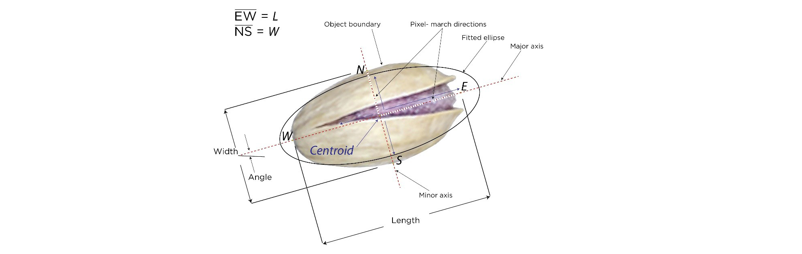

# Pistachio Binary Classification Project

## Problem

The goal of this project is to identify the type of pistachio based on its geometric properties. Since there are 2 types of pistachio considered, this is a binary classification problem. The project involves the following steps:
* exploring and preparing the dataset;
* training several machine learning models (Logistic Regression, Random Forest, XGBoost) and tuning their parameters;
* evaluating the models and selecting the best one;
* creating a web application with the final model using Flask and Gunicorn;
* deploying the model locally with Docker.

## Dataset

The dataset can be accessed via this [link to Kaggle](https://www.kaggle.com/datasets/belikesaif/16-attribute-pistachio-dataset/). It is also copied to the repository (see `Pistachio_Dataset.csv`).

### Description

The dataset focuses on binary classification of two categories:

* Kirmizi Pistachio  
* Siit Pistachio

It comprises 16 distinct attributes describing their area, perimeter, roundness, major and minor axes lengths, eccentricity, solidity, convex area, extent, aspect ratio, roundness, compactness, and various shape factors. In total, there are 2168 distinguishable entries in the dataset. The main objective of this dataset is to develop a binary classification model capable of accurately differentiating between the two types of pistachios based on these geometric attributes.

### Attributes

The attributes contained in the dataset are various numerical geometric properties. The properties were derived from pistachio images. The figure below illustrates the principal geometry of a pistachio image:



**<center>Figure 1. Pistachio geometry</center>**
<center>(from OZKAN IA., KOKLU M. and SARACOGLU R. (2021). Classification of Pistachio Species Using Improved K-NN Classifier. Progress in Nutrition, Vol. 23, N. 2. https://doi.org/10.23751/pn.v23i2.9686.)</center>

Below is the description of each attribute:
1. `Area` $A$: Area of the pistachio.
2. `Perimeter` $P$: Bean circumference defined as the length of its border.
3. `Major_axis` $L$: The distance between the ends of the longest line that can be drawn from a bean.
4. `Minor_axis` $l$: The longest line that can be drawn from the bean while standing perpendicular to the main axis.
5. `Eccentricity` $Ec$: Eccentricity of the ellipse having the same moments as the region (measure of how elongated or stretched the pistachio is).
6. `Eqdiasq` $Ed=\sqrt{\frac{4A}{\pi}}$: Equivalent diameter squared.
7. `Solidity` $S=A/C$: A measure of how solid or compact the pistachio's shape is.
8. `Convex_area` $C$: Number of pixels in the smallest convex polygon that can contain the area of a bean grain (the smallest convex shape that encloses the pistachio).
9. `Extent` $Ex=A/A_{B}$: A measure of how spread out or filled the area is within the pistachio's boundary ($A_{B}$ is the area of bounding rectangle).
10. `Aspect_Ratio` $K=L/l$: The ratio of major axis length to minor axis length, indicating the pistachio's elongation.
11. `Roundness` $R=\frac{4\pi A}{P^2}$: A measure of how round or circular the pistachio is.
12. `Compactness` $CO=Ed/L$: A measure of how compact or dense the pistachio is.
13. `Shapefactor_1` $SF1=L/A$
14. `Shapefactor_2` $SF2=l/A$
15. `Shapefactor_3` $SF3=\frac{A}{\frac{L}{2}\frac{L}{2}\pi}$
16. `Shapefactor_4` $SF4=\frac{A}{\frac{L}{2}\frac{l}{2}\pi}$

### Target

The target variable in the dataset is `Class`: a binomial attribute with two types: `Kirmizi_Pistachio` and `Siit_Pistachio`. For binary classification they are assigned values 1 and 0 respectively.

## Project Setup

#### 1. Clone the project from repository

```
git clone https://github.com/ValeryKarnevich/pistachio-binary-classification.git
cd pistachio-binary-classification
```

#### 2. Build the Docker image from Dockerfile

```
docker build -t project-image .
```

#### 3. Run the Docker container from the created image

```
docker run -it --rm -p 9696:9696 project-image
```

#### 4. Test the model

Navigate to project folder and run the test script from another terminal:

```
python predict-test.py
```

If setup is correct, the following output should be displayed:

```
{'kirmizi_probability': 0.454565660873593, 'pistachio_type': 'Siit'}
```

## Service Interaction 

To interact with the service in the active container, send a POST request to `http://localhost:9696/predict_pistachio` in the following JSON format (substitute your values into `xxx` for each attribute):

```
{
    "area": xxx,
    "perimeter": xxx,
    "major_axis": xxx,
    "minor_axis": xxx,
    "eccentricity": xxx,
    "eqdiasq": xxx,
    "solidity": xxx,
    "covex_area": xxx,
    "extent": xxx,
    "aspect_ratio": xxx,
    "roundness": xxx,
    "compactness": xxx,
    "shapefactor_1": xxx,
    "shapefactor_2": xxx,
    "shapefactor_3": xxx,
    "shapefactor_4": xxx
}
```

The service will respond with:  
* `kirmizi_probability` - a number between 0 and 1, where a number closer to 1 means higher chance of Kirmizi than Siit and a number closer to 0 otherwise, with 0.5 used as a threshold;  
* `pistachio_type` - the predicted pistachio type based on the probability value.

You may use a script similar to `predict-test.py` for interacting with the service.

## Additional Information

For the dataset preparation, EDA, model training and evaluation, see `notebook.ipynb` file.

For the script used for training the final model and saving it, see `train.py` file.

For creating a web application with the final model, see `predict.py` script.

For the list of Python dependencies used to run the service, see `Pipfile`.
